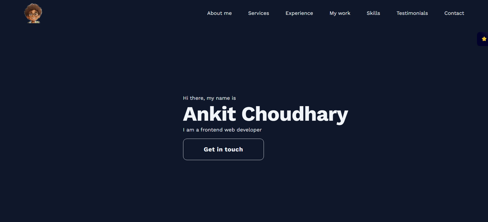

# Ankit Choudhary Portfolio

This is my portfolio website showcasing my frontend development projects, experience, skills and, much more.

[Portfolio](https://ankitnub.vercel.app/)

## Table of Contents

- [Overview](#overview)
- [Technologies Used](#technologies-used)
- [Features](#features)
- [Contributing](#contributing)
- [About Me](#about-me)
- [Get Started](#get-started)
- [License](#license)
- [Contact](#contact)

## Overview

Welcome to my portfolio website! Here, you can explore the various frontend development projects I've worked on. Each project demonstrates my skills in HTML, CSS, JavaScript, and more. Feel free to browse through and get in touch if you'd like to collaborate or have any questions.

## Technologies Used

- HTML5
- CSS3
- JavaScript
- React.js
- Matreial UI
- Styled Components
- Framer motion

## Features

- One page layout
- Fully responsive
- Styled with Material UI and styled-components
- Reveal Animation

## Contributing

If you'd like to contribute to this project, please follow these guidelines:

1. Fork the repository.
2. Create a new branch: `git checkout -b feature/your-feature-name`
3. Commit your changes: `git commit -m 'Add some feature'`
4. Push to the branch: `git push origin feature/your-feature-name`
5. Submit a pull request.

## About Me

I'm a passionate frontend developer with experience in creating interactive and user-friendly web applications. I enjoy tackling challenges and learning new technologies to enhance my skills. With a solid foundation in HTML, CSS, and JavaScript, I enjoy bringing designs to life and building intuitive interfaces.

## Get Started

Clone down this repository. You will need `node.js` and `git` installed globally on your machine.

### Installation and Setup Instructions

1. Installation: `npm install`
2. In the project directory, you can run: `npm start`

Runs the app in the development mode.
Open [http://localhost:3000](http://localhost:3000) to view it in your browser.

## Contact

Feel free to reach out to me:

- GitHub: [@ankitnub](https://github.com/AnkitNub)
- LinkedIn: [Ankit Choudhary](https://www.linkedin.com/in/ankitnub/)
- Email: ankitc23413@gmail.com

Let's connect and discuss your next project!

Give me a start ⭐ if you liked my portfolio.
